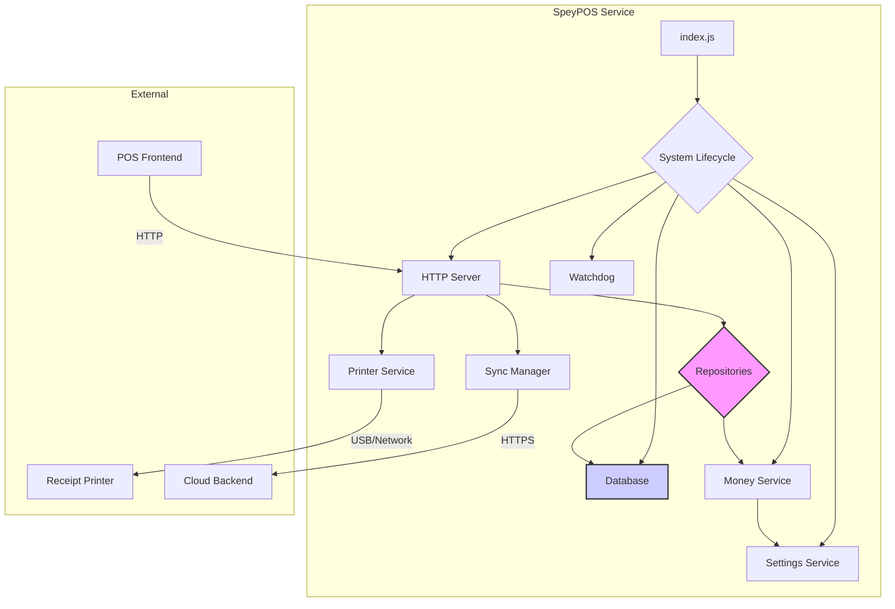

# Architecture

This document outlines the high-level architecture of the SpeyPOS system.

## Guiding Principles

-   **Offline-First**: The system must be fully functional without an internet connection.
-   **Reliability**: The system must be resilient to crashes and power failures, ensuring no loss of critical transaction data.
-   **Modularity**: Each component has a single, well-defined responsibility.

## System Components

### Component Responsibilities

-   **`index.js` (Entrypoint)**: Initializes configuration and starts the system lifecycle.
-   **`system/lifecycle.js`**: Manages the startup and graceful shutdown of all services (Server, Database, etc.).
-   **`system/watchdog.js`**: Implements crash detection and recovery logic, such as checking for incomplete transactions on startup.
-   **`server/httpServer.js`**: Provides a localhost REST API for the POS frontend application. All business logic flows through here.
-   **`storage/database.js`**: Manages the SQLite database connection and runs migrations.
-   **`storage/repositories/*.js`**: Contains all SQL queries. This is the only module that directly interacts with the database.
-   **`services/money.service.js`**: A centralized service for handling all monetary values. It normalizes UI inputs to integers for storage and formats them back to currency strings for display, based on the active currency setting.
-   **`printer/printerService.js`**: Abstract service for printing receipts. It can be configured to use a real printer or log to the console for development.
-   **`sync/syncManager.js`**: Handles the process of syncing data to the cloud. This is typically triggered at the end of a shift. It uses a persistent queue to ensure data is not lost if the sync fails.
