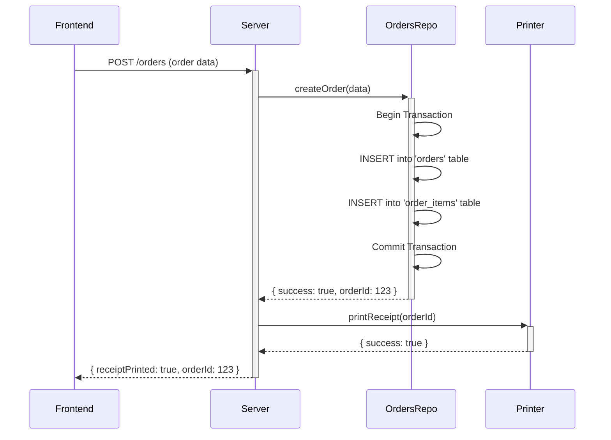

# Data Flow

This document describes the flow of data for critical operations.

## 1. Creating an Order

The primary goal is to ensure an order is durably saved before any external action is taken.



**Key Guarantees:**

1.  All monetary values (`unit_price`, `customization.price`, etc.) in the order payload are normalized to integers in their smallest unit (e.g., cents) by the `MoneyService` before any calculations or database operations occur.
2.  The order is written to the SQLite database within a transaction.
3.  The receipt is only printed _after_ the database transaction is successfully committed.
4.  If the system crashes after the commit but before printing, the `watchdog` can identify the unprinted order on restart.

## 2. Background Cloud Sync (Mini-Batch + Shift Flush)

Data is synced to the cloud in a non-blocking, best-effort manner.

```mermaid
sequenceDiagram
    participant Frontend
    participant Server
    participant SyncManager
    participant CloudBackend

    Note over Server,SyncManager: During active shift
    Server->>+SyncManager: maybeEnqueueMiniBatchForActiveShift()
    SyncManager->>SyncManager: If finalized unsynced >= SYNC_MINI_BATCH_SIZE, enqueue mini-batch
    SyncManager-->>-Server: return immediately (non-blocking)

    Note over Server,SyncManager: At shift close
    Frontend->>+Server: PATCH /shift/:id { status: "closed" }
    Server->>+SyncManager: enqueueFlushForShift(shiftId)
    SyncManager-->>-Server: return immediately (non-blocking)
    Server-->>-Frontend: { shiftClosed: true }

    Note over SyncManager,CloudBackend: Background worker processes queue
    SyncManager->>SyncManager: Load finalized unsynced orders for target shift in chunks
    SyncManager->>+CloudBackend: POST event batch + POST events for one chunk
    alt Chunk upload succeeds
        CloudBackend-->>-SyncManager: success
        SyncManager->>SyncManager: Mark uploaded orders cloud_sync_at
    else Chunk upload fails
        CloudBackend-->>-SyncManager: error
        SyncManager->>SyncManager: Keep job in queue with retry_count/last_attempt_at
    end
```

**Key Guarantees:**

1.  Order lifecycle API paths do not wait on cloud network upload; uploads are background only.
2.  Mini-batches are scoped to the currently active shift at processing time.
3.  Shift close triggers a background flush that drains any remaining finalized unsynced orders.
4.  Failed chunk uploads are safely retried through the persistent queue without losing local data.
